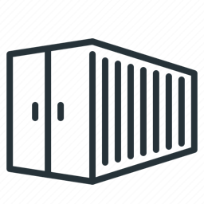

# Container Image for containers on Photon OS



## Status

|                     |                                                                                                               |
|---------------------|---------------------------------------------------------------------------------------------------------------|
| Build Docker Image  |       |
| Build Documentation |  |

## Overview

Provides overview documentation of the containers in this project/repository.

This image includes the following components:

| Component        | Version | Description                                                                 |
|------------------|---------|-----------------------------------------------------------------------------|
| VMware Photon OS | 4.0     | A Linux container host optimized for vSphere and cloud-computing platforms. |
| mkdocs           |         |                                                                             |
| mkdocs-material  |         |                                                                             |

## Get Started

Run the following to download the latest container from Harbor:

```bash
docker pull harbor.sydeng.vmware.com/rcroft/containers:latest
```

Run the following to download a specific version from Harbor:

```bash
docker pull harbor.sydeng.vmware.com/rcroft/containers:x.y.z
```

Open an interactive terminal:

```bash
docker run --rm -it harbor.sydeng.vmware.com/rcroft/containers
```
