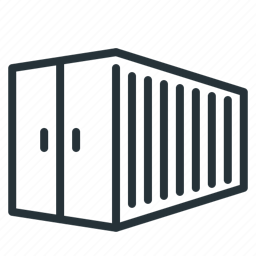

    </img>

Lorem ipsum dolor sit amet, consectetur adipiscing elit. Pellentesque nec maximus ex. Sed consequat, nulla quis malesuada dapibus, elit metus vehicula erat, ut egestas tellus eros at risus. In hac habitasse platea dictumst. Phasellus id lacus pulvinar erat consequat pretium. Morbi malesuada arcu mauris Nam vel justo sem. Nam placerat purus non varius luctus. Integer pretium leo in sem rhoncus, quis gravida orci mollis. Proin id aliquam est. Vivamus in nunc ac metus tristique pellentesque. Suspendisse viverra urna in accumsan aliquet.

Donec volutpat, elit ac volutpat laoreet, turpis dolor semper nibh, et dictum massa ex pulvinar elit. Curabitur commodo sit amet dolor sed mattis. Etiam tempor odio eu nisi gravida cursus. Maecenas ante enim, fermentum sit amet molestie nec, mollis ac libero. Vivamus sagittis suscipit eros ut luctus.

Nunc vehicula sagittis condimentum. Cras facilisis bibendum lorem et feugiat. In auctor accumsan ligula, at consectetur erat commodo quis. Morbi ac nunc pharetra, pellentesque risus in, consectetur urna. Nulla id enim facilisis arcu tincidunt pulvinar. Vestibulum laoreet risus scelerisque porta congue. In velit purus, dictum quis neque nec, molestie viverra risus. Nam pellentesque tellus id elit ultricies, vel finibus erat cursus.

## Summary of Docker Images

- { .lg .middle } **Containers** - Jump off point for all docs of all container projects.
- { .lg .middle } **Hugo** - For building static websites using Hugo.
- { .lg .middle } **MkDocs** - For building static websites using MkDocs.
- { .lg .middle } **Packer** - For building templated VMs using Hashicorp Packer.
- { .lg .middle } **Packer Plus** - For building templated VMs using Ansible/Packer/etc.
- { .lg .middle } **PowerCLI** - For running PowerShell and VMware PowerCLI scripts.
- { .lg .middle } **Tanzu** - For interacting with Kubernetes/Tanzu clusters.
- { .lg .middle } **Terraform** - For managing VMs/OVFs/etc on VMware vSphere.
- { .lg .middle } **The Works** - All/Most of the above in a single image.

